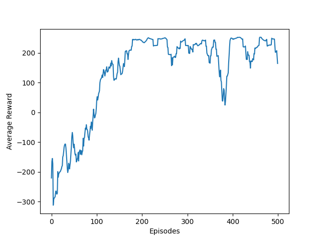

# Double Duelling Deep Q Network for the Lunar Lander environment

## **Requirements**

- Python 3.10
- Numpy
- Pytorch 1.13
- Gym 0.26.2
  > [Lunar Lander Environment Docs](https://www.gymlibrary.dev/environments/box2d/lunar_lander/)

## **Results**

## **Deep Q Learning**

- **What is Q learning?**

  - A **Model-Free Reinforcement Learning** algorithm to learn the **Quality** value of taking an **Action** in a particular **State**.

    > [Learn more](https://en.wikipedia.org/wiki/Q-learning)

  - Following the **Bellman update equation**, we can train an agent to take high _**quality**_ actions that lead to states that maximize return in _**reward**_

    

  - we construct a **Q**uality table of **states** , **actions**, **rewards**, and iteratively update it with the equation above.

- **Applying Deep Learning**

  - Instead of storing a table of **state transitions**, use **nueral networks** to approximate the **Q** function.
    > **Why?** When dealing with _extremely large_ or _continuous_ state spaces, storing the **Q**uality function in a table is no longer feasible.
  - **New Update Equation**:

    

- **Modifictions**

  - **Double Deep Q Networks**

    - Use two Nueral Networks
      - **Q** Network
      - **Q_target** Network
    - Calculate loss between them, with respect to some reward
    - Copy Q Network weights to Q_target Network every N iterations
    - **Purpose:** Stabilize training
    - **Updated Equation:**

      

  - **Double Duelling Q Networks**

    - Using the same technique above, we change the Nueral Network architecture to produce a **V**alue for being in a state and reward estimates for all possible **A**ctions, then calculate **Q**uality
    - **Architecture diagram**

      

    - **Updated Equation:**

      

**References:**

- [Mnih, V., Kavukcuoglu, K., Silver, D., Graves, A., Antonoglou, I., Wierstra, D. & Riedmiller, M. (2013). Playing Atari with Deep Reinforcement Learning](https://arxiv.org/pdf/1312.5602.pdf)
- [van Hasselt, H., Guez, A. & Silver, D. (2015). Deep Reinforcement Learning with Double Q-learning.](https://arxiv.org/pdf/1509.06461.pdf)
- [Wang, Z., Schaul, T., Hessel, M., van Hasselt, H., Lanctot, M. & de Freitas, N. (2015). Dueling Network Architectures for Deep Reinforcement Learning](https://arxiv.org/pdf/1511.06581.pdf)
